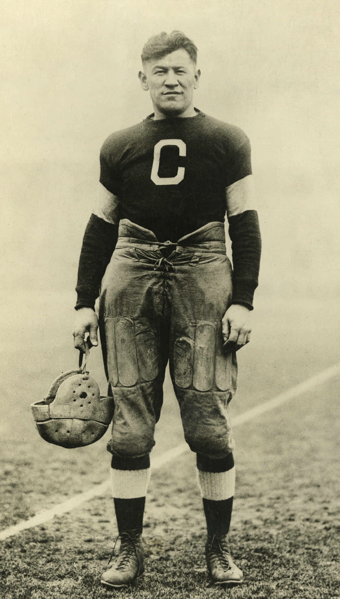

---
output:
  pdf_document:
    fig_caption: true
    number_sections: true
---

\centerline{\Large{MAT022 Foundations of Statistics and Data Science}} \  
\centerline{\Large{Summative Assessment 2019/20}} \  
\newline
\newline
\centerline{\Large{Charles Wills}} \  
\centerline{\Large{c1977808}} \  
\newline
\newline
\centerline{\Large{`r format(Sys.Date(), "%d/%m/%Y")`}}

\newpage
\tableofcontents
\newpage

```{r setup, include=FALSE}
knitr::opts_chunk$set(echo = FALSE)

library(dplyr)
library(tibble)
library(ggplot2)
library(readr)
library(stringr)
library(tidyr)
library(scales)
library(janitor)
library(GDAdata)
library(EnvStats)
library(lawstat)
library(PMCMR)

# ensure consistent column names are used for each event with either a r_* or p_* prefix representing result (in whichever unit the event is measured in) and points (a standardised measure across the events). This can then be used to transform the data to tidy form. 

original_decathlon <- Decathlon

colnames(Decathlon) <- 
  c("total_points", "name", "nationality",
    "r_100m", "r_long_jump", "r_shotput",
    "r_high_jump", "r_400m", "r_110m_hurdles",
    "r_discus", "r_polevault", "r_javelin",
    "r_1500m",
    "year",
    "p_100m", "p_long_jump", "p_shotput",
    "p_high_jump", "p_400m", "p_110m_hurdles",
    "p_discus", "p_polevault", "p_javelin",
    "p_1500m")

ioc_codes <- read_csv("data/ioc_codes.csv")
continent_lookup <- 
read_csv("data/continent_codes.csv") %>%
select(continent = Continent_Name, country_code = Three_Letter_Country_Code)

# create tidy version of decathlon data
decathlon_data <- 
  as_tibble(Decathlon) %>% 
  select(total_points:nationality, year, everything()) %>% 
  gather(event, result,
       -(total_points:year)) %>% 
  mutate(type_of_result = 
           case_when(str_detect(event, "r_") ~ "result",
                     str_detect(event, "p_") ~ "points"),
         event = str_sub(event, 3)) %>% 
  spread(type_of_result, result) %>% 
  left_join(ioc_codes, by = c("nationality" = "code")) %>% 
  left_join(y = continent_lookup,
            by = c("nationality" = "country_code")) %>% 
  select(total_points, 
         name = name.x, 
         nationality_code = nationality, 
         nationality = name.y,
         continent,
         everything())


# read in olympic data for comparison
olympic_data <- 
  read_csv('data/olympic_track_and_field') %>% 
  clean_names()

# function to output a tibble of results for olympians and decathletes. This can be used to perform a t-test.
events_to_compare <- function(olympic_event, decathlon_event, tail){
  # result of professional athletes
  professional <- 
    olympic_data %>% 
    filter(year >= 1984,
           year <= 2008,
           event == olympic_event) %>% 
    select(result) %>% 
    add_column(athlete_type = 'professional',
               .before = 1)
  professional$result <- as.numeric(professional$result)
  
  # result of decathletes
  decathlete <-
    decathlon_data %>% 
    filter(event == decathlon_event) %>% 
    group_by(year) %>% 
    top_n(3, result) %>% 
    ungroup() %>% 
    select(result) %>% 
    add_column(athlete_type = 'decathlete',
               .before = 1)
  
  # combine into single tibble
  combined_df <- bind_rows(professional, decathlete)
  combined_df$athlete_type <- as.factor(combined_df$athlete_type)
  
  descriptives <- 
    combined_df %>% 
    group_by(athlete_type) %>% 
    summarise(mean = mean(result, na.rm = TRUE),
              sd = sd(result),
              n = n())

  lv_output <- 
    levene.test(y = combined_df$result,
                group = combined_df$athlete_type, 
                location = 'mean')
    
  tt_output <- 
    t.test(result ~ athlete_type,
           data = combined_df,
           alternative = tail,
           var.equal = TRUE)
  
  return(list(combined_df,
              descriptives,
              lv_output,
              tt_output))
}
```

# Abstract

This report studies the results of top performances in the Decathlon between 1985 and 2006. It compares the performance of the decathletes with Olympic medalists in three individual events; 100m, discus and high jump. It concludes that the decathletes perform significantly worse than the Olympic medalists.

It also looks at the total points scored by continent in an attempt to understand which continent produces the best and worst decathletes. It finds that the lowest performing decathletes come from Asia and the highest performing from Eurasia. 


# Introduction

```{r out.width='30%', out.height='30%', fig.align='center', fig.cap="Jim Thorpe, 1912 Olympic gold medalist."}

```

\  

\centerline{\LARGE{"You, sir, are the greatest athlete in the world"}}

\  

King Gustav of Sweden declared when he handed the winner's prize to Jim Thorpe at the 1912 Olympic games in Stockholm. A bold statement maybe, but can you argue with his logic? Thorpe had proven himself to be the best athlete across ten different sports. It's harder to be great at ten sports than one, therefore he must be the best athlete in the world. In this paper we will investigate if decathletes can lay stake to this claim by comparing them with olympians in their respective events. 

We'll then investigate whether there is a difference in performance between continents. If there is we'll dive further into which continents have produced the best decathletes and speculate on potential reasons for this. Descriptive analysis will be carried out before this to better understand the data we are working with and a conclusion will be provided after to summarise the findings. 

# Background

Decathlon has long been an interesting event. It's one of few sports that requires an athlete to compete across such a variety of events. With so many component parts making up a decathletes final points tally, it seems certain that a story lies hidden within the data. This report views the decathlon through a statistical lens, discovering insight about previously unseen features, before trying to quantify whether decathletes can compete with olympians.

There are many preconceptions about which corner of the globe produces the best athletes. Jamaica have a history of talented sprinters, the USA perform strongly in a variety of events, and more recently China have announced themselves on the world athletics stage. This report aims to provide a statistically sound answer to the question; who produces the best decathletes? 

The analysis has been produced using R and the report has been compiled using RMarkdown. Key concepts have been taken from Wickham and Grolemund (2016) who authored a collection of R packages called the `tidyverse`. These packages share a common Application Programming Interface (API) allowing for a consistent and reproducible programming style.

# Exploratory Data Analysis

```{r}
summary_totalpoints <- summary(Decathlon$total_points)
```

The decathlon dataset records the performance of decathletes between 1985 and 2006. It has `r comma(nrow(Decathlon))` observations with no missing data and `r comma(length(unique(Decathlon$name)))` unique decathletes from `r nlevels(original_decathlon$Nationality)` countries. The points and result for each of the ten events is given and the total points column indicates their performance across all events. Only those who scored over 6,800 total points are included in the dataset. The decathlete with the highest total points after the ten events is crowned the winner. 

The average total points tally, by median, is `r round(summary_totalpoints[[3]]) %>% comma()` with half of all athlete's scoring between `r round(summary_totalpoints[[2]]) %>% comma()` and `r round(summary_totalpoints[[4]]) %>% comma()`. The histogram of total points shows a positive skew, which can also be seen by the mean exceeding the median, where we see more observations on the right tail of the graph. These are the athlete's with the highest points tally, who are likely to have won the decathlon.

```{r}
print(summary_totalpoints)
```

```{r out.width='75%', fig.cap="\\label{fig:points_hist}Histogram showing distribution of total points."}
ggplot(Decathlon) + 
  geom_histogram(aes(total_points), bins = 15) +
  labs(x = 'Total Points', y = 'Count')
```


The name and data type of each variable can be found in the [Appendix A]. They can broadly be split into three groups;

1. `DecathleteName`, `Nationality`, and `yearEvent` all provide additional information about the athlete and the event they took part in.
2. `m100` to `m1500` represent their result in each of the 10 events. The units are relevant to the activity e.g. metres, seconds.
3. `P100m` to `P1500` represent the number of points they scored for each of the 10 events.

We can also view the distribution of points scored in each of the 10 events to understand if certain events prove more difficult to score points in. The red dotted line shows the median points score across all 10 events.

```{r, out.width='75%', fig.align='center', fig.cap="\\label{fig:points_box}Boxplot of points scored by event."}
ggplot(decathlon_data) + 
  geom_boxplot(aes(reorder(event, -points), points), outlier.shape = NA) +
  coord_flip() +
  geom_hline(yintercept = median(decathlon_data$points),
             colour = "red", linetype = "dotted", size = 1) +
  labs(x = "")
```

Events that involve throwing such as Javelin, Shot put and Discus tend to yield a lower points score. Meanwhile track events such as 400 metres, 100 metres, and 110 metre hurdles are where the decathletes collect the most points. This may suggest that running events are easier to score points in. However it may also suggest these are the events decathletes perform best in and are therefore more likely to compete with olympians in a running event than a throwing event.

In the [Decathletes by Continent] section we'll investigate if there is a significant difference between decathletes from different continents. It is also explained in this section how the continent groups were formed. The table below shows the average total points by continent, as well as standard deviation and sample size. 

```{r, include=FALSE}
name_continent_lookup <- 
  Decathlon %>% 
  as_tibble() %>%
  left_join(continent_lookup, c("nationality" = "country_code")) %>% 
  select(name, continent) %>%
  distinct(name, .keep_all = TRUE)

points_by_continent <- 
  Decathlon %>% 
  as_tibble() %>%
  group_by(name) %>% 
  summarise(avg_points = mean(total_points)) %>% 
  left_join(name_continent_lookup, by = "name") %>% 
  mutate(continent = as.factor(continent))

continent_summary <- 
  points_by_continent %>% 
  group_by(continent) %>% 
  summarise(mean = mean(avg_points),
            sd = sd(avg_points),
            n = n())
```

```{r}
knitr::kable(continent_summary %>% arrange(mean) %>% rename(Continent = continent, Mean = mean, `Std Dev` = sd, `Sample Size` = n), digits = 2, caption = "Summary of total points by continent")
```

This table suggests that Asia are the lowest performing continent and Eurasia are the highest performing. However, Eurasia show the highest spread of observations shown by their standard deviation, while Asia have the lowest standard deviation. Therefore could we consider these differences statistically significant? If you'd like to read about the results of the analysis by continent skip to the [Decathletes by Continent] section.

# Decathletes vs Olympic Medalists

So can we consider decathletes the best athletes in the world? To answer this we need to compare the decathletes performance with professionals in respective events. If a decathlete can claim to be the best athlete in the world, they should be at least as good as athletes that focus only on one event. Should the data show there is no statistical significance between results of decathletes and professionals, then it's fair to conclude King Gustav was correct when he declared Jim Thorpe "the greatest athlete in the world" after his gold medal in the decathlon in 1912.

To make this comparison we'll need an additional dataset. We'll use an Olympic track and field dataset from Kaggle. This has the result of every athletic event at the Olympic games between 1896 and 2016. This data was originally web scraped from the official Olympic website. It has results for both male and female olympians. As the decathlon is a male only event we will filter the Olympic dataset to include only males. This will ensure we're comparing like-for-like groups. It's important to briefly discuss potential limitations with this data:

- It was compiled by a third party and results from the 1988 Olympics are missing. While I have reviewed the code used to collate the data it's still possible other errors or exclusions have occurred.
- It includes results at Olympic games, these only occur every four years. This leads to a smaller sample than the decathlon dataset offers when comparing similar time periods.
- It covers a different range of years than the decathlon dataset.
- It only records the results of the medalists (gold, silver and bronze). This means the results are for only the three best performers in each event.

To overcome these limitations we'll need to make a few adjustments:

- Only analyse years that are in both the decathlon and Olympic datasets i.e. 1985 - 2006. Note: Due to the Olympic data containing fewer observations we'll actually use the year range of 1984 - 2008 to ensure our sample size is sufficient.
- Extract the top three performers from each year in the decathlon dataset. This ensures we're comparing elite performers in both datasets. Otherwise we'd be comparing only Olympic medalists with all decathletes, which may bias the results.

We'll start with the 100m sprint by testing if decathletes are significantly slower than Olympic sprinters. While this wasn't the event that yielded the highest average points tally (as seen in Figure \ref{fig:points_box}), it's the most popular Olympic event and has therefore been chosen as a comparison. To do this we'll use a two-sample t-test. This compares the mean of two groups and tests to see if they are significantly different from each other. The table below shows the average 100m time for the decathletes and the olympians. It's clear the olympians yield a better result, they average a time that's over two seconds faster than the decathletes, but is this difference statistically significant?

## Step 1 - Define the hypothesis

It's important we do this before consulting the data. If not, we risk potentially biasing the results by choosing parameters that fit our agenda. Here we are trying to determine if decathletes are significantly slower than Olympic sprinters in the 100m. Therefore we will test the following hypothesis:

$H_0: \mu_D = \mu_P$ (The mean 100m time is the same for the decathletes as it is for the Olympic sprinters.)

$H_1: \mu_D > \mu_P$ (The mean 100m time is greater for the decathletes than it is for the Olympic sprinters.)

## Step 2 - Construct the test

We're going to perform a one-tailed, two-sample t-test using the conventional 5% significance level. We have chosen a one-tailed test as we are assuming the decathletes will not be faster than the olympians. The t-test compares the means from two independent samples and assumes that:

- The observations are independent between each group.
- The measurements in each population follow a normal distribution.
- The populations the samples came from have equal variance.

We can assume the first assumption holds as it's extremely unlikely, if not impossible, that an athlete could compete in two completely separate events in one Olympic games. Now let's check if the other two assumptions hold true for our data. To check for normality, a simple Q-Q (Quantile-Quantile) plot can be used. Below is the Q-Q plot for the decathletes. The second Q-Q plot, for the olympians, can be found in [Appendix B].

```{r out.width="75%", fig.cap="Quantile-Quantile plot for decathletes."}
hundred_m <- events_to_compare('100M Men', '100m', 'greater')

qqnorm(y = filter(hundred_m[[1]], athlete_type == 'decathlete')$result)
qqline(filter(hundred_m[[1]], athlete_type == 'decathlete')$result,
         col = "steelblue", lwd = 2)
```

The points on both plots lie close to the blue line, which represents a theoretical normal Q-Q plot. Therefore we can be satisfied the first assumption of normality holds true. To check the populations of both samples have equal variance we can perform Levene's test. This is also a hypothesis test, therefore we need to define the hypothesis and then run the test:

$H_0: \sigma_D^2 = \sigma_P^2$ (Variances **are** equal between samples)

$H_1: \sigma_D^2 \neq \sigma_P^2$ (Variances **are not** equal between samples)

Using $\alpha = 0.05$ and the classical Levene's procedure whereby the distance from the mean, rather than median, is used in the calculation. As discussed by Brown and Forsythe (1974, pp. 364-367), the mean is a good choice when you have symmetric and moderately tailed distributions and when the underlying shape of the distribution is known.

```{r}
hundred_m[[3]]
```

The resulting p-value of the test is `r round(hundred_m[[3]][['p.value']], 3)` (3dp). As this is greater than our significance level of 0.05 we do not have sufficient evidence to reject $H_0$. We can therefore assume the variances are equal between the samples which means the second assumption is satisfied.

## Step 3 - Perform the test

Now we've constructed our test and selected our parameters we can consult that data and perform the test. Below is a table with a summary of both groups being compared. Showing that decathletes have a slower 100m time than olympians. 

```{r}
knitr::kable(hundred_m[[2]] %>% mutate(athlete_type = ifelse(athlete_type == "decathlete", "Decathlete", "Olympian")) %>% rename(`Athlete Type` = athlete_type, Mean = mean, `Std Dev` = sd, `Sample Size` = n), digits = 3, caption = "Summary of 100m sprint time for decathletes and olympians (in seconds).")
```

```{r}
hundred_m[[4]]
```

## Step 4 - Conclusion

The resulting p-value (<0.001) is far smaller than our significance level (0.05). This means we can strongly reject $H_0$ in favour of $H_1$ and conclude that the decathletes are significantly slower at running the 100m than the Olympic sprinters. The 95% confidence interval suggests the true difference in 100m time between decathletes and Olympic sprinters is more than two seconds. This probably isn't a surprising result, winning an Olympic medal in the 100m sprint is extremely difficult and we'd expect no other cohort to compare. 

So can we conclude that King Gustav was wrong when he declared Jim Thorpe the "greatest athlete in the world"? Well, sprinting is just one area of the decathlon, so let's perform a similar test for two completely different decathlon events; High jump (jumping) and Discus (throwing). These two events have been chosen arbitrarily to represent the jumping and throwing events. 

The High jump and Discus satisfy the same assumptions as above and yield the following mean, standard deviation, and sample size.

\newpage

```{r}
discus <- events_to_compare('Discus Throw Men', 'discus', 'less')
knitr::kable(discus[[2]] %>% 
               mutate(mean = round(mean, 3),
                      sd = round(sd, 3)) %>%
               mutate(athlete_type = ifelse(athlete_type == "decathlete", "Decathlete", "Olympian")) %>% 
               rename(Discus = athlete_type,
                      Mean = mean,
                      `Std Dev` = sd,
                      `Sample Size` = n),
             caption = "Summary of distance decathletes and olympians throw the discus (in metres).")
```

```{r}
high_jump <- events_to_compare('High Jump Men', 'high_jump', 'less')
knitr::kable(high_jump[[2]] %>% 
               mutate(mean = round(mean, 3),
                      sd = round(sd, 3)) %>% 
               mutate(athlete_type = ifelse(athlete_type == "decathlete", "Decathlete", "Olympian")) %>% 
               rename(`High Jump` = athlete_type,
                      Mean = mean,
                      `Std Dev` = sd,
                      `Sample Size` = n),
             caption = "Summary of height decathletes and olympians reach on the high jump (in metres).")
```

Using the same hypothesis and significance level as above, we get the following results:

```{r}
knitr::kable(
  tibble(
  Event = c("Discus", "High Jump"),
  `p-value (3dp)` = c("<0.001", "<0.001"),
  `Lower Conf Int` = c(discus[[4]]$conf.int[1], high_jump[[4]]$conf.int[1]),
       `Upper Conf Int` = c(discus[[4]]$conf.int[2], high_jump[[4]]$conf.int[2]) %>% round(3)
       )
, caption = "Result of t-test for Discus and High jump events.")
```


It turns out the decathletes average significantly lower scores than the Olympic athletes. For the high jump, the true difference between the decathletes and olympians mean score is more than 16cm. For the discus, the true difference is more than 15 metres. Therefore it's probably fair to say King Gustav was incorrect, or at least not entirely correct. While Jim Thorpe was a fantastic athlete, he wouldn't have stood much of a chance when running, jumping, or throwing against Olympic champions. Sorry, Jim.


# Decathletes by Continent

We've seen that decathletes can't compete with olympians in the individual events that make up the decathlon. But how do they compare amongst themselves? More specifically, who produces the best decathletes? To answer this, we could compare multiple countries with one another, but with `r Decathlon$nationality %>% unique() %>% length()` different countries it could take a while. A better way to answer this question is by grouping each decathlete by continent. The question then becomes; which continent produces the best decathletes?

To answer this we need a country to continent lookup table, this has been sourced from the internet. Similarly to the Olympic data this has been compiled by a third party which needs to be considered with respect to accuracy. We can then use this lookup to get the continent each decathlete represents. A new set of problems arise;

- Decathletes have represented countries that are no longer officially recognised. For example; the Soviet Union and East and West Germany. In an attempt not to lose data these countries have been mapped to the most appropriate continent based on their new country name. For example West Germany maps to Germany which maps to Europe.
- Countries that span multiple continents, namely Europe and Asia, meant it impossible to classify as one or the other. All these cases occurred in Eurasia which has subsequently formed it's own group, despite not being an officially recognised continent. 

As we're looking to compare the means between three or more groups, that suggests a one-way ANOVA test may be sensible. The assumptions are similar to those of the t-test we performed earlier. Firstly, the underlying distributions are assumed to be normal. As seen in Figure \ref{fig:points_hist} the total points variable is not normally distributed, it's positively skewed. Therefore we aren't able to use one-way ANOVA and will instead need to use a non-parametric alternative which makes no assumption about the underlying distribution.

The Kruskal-Wallis rank sum test is considered the non-parametric equivalent of one-way ANOVA. It assumes  each group (ie continent) has the same shape. This can be checked with a simple boxplot which confirms the assumption holds.

```{r include=FALSE}
# run kruskal-wallis test
kruskal_res <- kruskal.test(formula = avg_points ~ continent, data = points_by_continent)
```

```{r, out.width='75%', fig.align='center', fig.cap="Average total points by continent"}
points_by_continent %>% 
  ggplot(aes(continent, avg_points)) +
  geom_boxplot() +
  labs(x = "",
       y = "Points")
```

It also requires independence of observations within and between groups. That is, no decathlete can appear more than once in the data. As it stands we are violating this condition, many decathletes have competed over multiple years which means the observations are not considered independent. To overcome this we can average each decathletes score across all their decathlons and that points total will form an observation. Therefore we now have `r nrow(points_by_continent)` observations, one for each unique decathlete. As with all statistical tests we will define the hypothesis and construct the test before consulting the data. 

## Step 1 - Define the hypothesis

The Kruskal-Wallis test assigns a rank based on the observation and calculates the median rank for each group. Therefore we test whether the median of all groups are equal:

$H_0: \eta_1 = \eta_2 = ... = \eta_7$ (The median rank of all continents are equal.)

$H_1: \eta_i \neq \eta_j$ for some $i \neq j$ (At least two continents have a different median rank.)

## Step 2 - Construct the test

We will use the conventional significance level of $\alpha = 0.05$. The Kruskal-Wallis test statistic can be written as:

$H=\frac{12}{N(N+1)}\sum_{i=1}^{k}\frac{T_i^2}{n_i}-3(N+1)$

where;

- N is the total number of observations.
- $T_i$ is the rank sum for the $i$th group.
- $n_i$ is the median of group $i$.

It can be shown that if the null hypothesis is true then H is approximately distributed like a random variable from a Chi-square distribution on k-1 degrees of freedom. Therefore the critical value can be calculated by $\chi_6^2 = 12.592$ (with $\alpha = 0.05$ and rounded to 3dp). If our test statistic exceeds this critical value we can reject the null hypothesis.

## Step 3 - Perform the test

```{r}
kruskal_res
```

## Step 4 - Conclusion

Our test statistic (`r round(kruskal_res[[1]][[1]], 3)`) greatly exceeds our critical value (12.592) which means we can strongly reject $H_0$ in favour of $H_1$. This is also confirmed by our p-value (<0.001) being far smaller than our significance level of 0.05. We can interpret this as at least two continents show a significant difference in points scored. This means that at least one continent is better than one other continent. But we can't conclude yet which continents these are. For that we have to perform post hoc tests.

## Step 5 - Post hoc tests

To compare continents we could run several pairwise comparisons using the Mann-Whitney sum of ranks test. This is the non-parametric equivalent of the two sample t-test. However, this can prove time consuming when comparing seven groups. Therefore, a more suitable post hoc test is Connover & Iman's procedure for multiple comparisons. 

Another consideration we have to make is around unintentionally inflating the risk of Type I error. If we are making multiple comparisons between groups using significance level $\alpha = 0.05$ we'd only have to make $1 \div 0.05 = 20$ comparisons before we would expect to incorrectly reject $H_0$. Therefore we have to make an adjustment to our significance level. For the Conover & Iman procedure we will use the Bonferonni correction. This is calculated by dividing the original significance level by the number of comparisons we are making. We have seven continents which means we'll be making 21 comparisons. Therefore our corrected significance level is $0.05 \div 21 = 0.002$ (3dp).

To be explicit our hypotheses for these comparisons are:

$H_0: \eta_i = \eta_j$

$H_1: \eta_i \neq \eta_j$

Conover and Iman's multiple comparisons yields the following p-values for each combination of continents.

```{r, include=FALSE}
con_iman <- posthoc.kruskal.conover.test(avg_points ~ continent, data = points_by_continent, p.adjust.method = "bonferroni")
```

```{r}
con_iman
```

This can be interpreted such that a p-value between two continents that is less than our Bonferroni corrected p-value (0.002) suggests a significant difference between the continents performance. From the table above these are; Asia and Eurasia, Asia and Europe, Asia and North America, Eurasia and Europe, Eurasia and South America.

It can be difficult to summarise multiple comparisons tests succinctly but this seems to suggest that Asia perform the worst at decathlon. They record significantly lower points totals than three other continents. While Asia have performed well in recent years in track and field events it could be argued this was a result of Beijing hosting the 2012 summer Olympics. Before this time the investment in Asian track and field events was more limited, which could explain this finding. 

Meanwhile, Eurasia seem to be the continent that produces the best decathletes, showing statistically significant gaps to Asia, Europe, and South America. Towards the end of the cold war the Soviet Union, which makes up a high proportion of the Eurasia group, had a lot of success in track and field events and plenty of money was invested in it. This may explain why they appear to be the most successful continent in the decathlon. 

# Conclusion

The first question this report looked at was whether decathletes are as good as olympians in individual events. It was found that olympians achieved statistically significantly better results than decathletes at 100m, Discus and High Jump. Three separate t-tests were conducted to reach this conclusion. To further this analysis a t-test could be ran for each of the ten events. We could also have grouped the events in the decathlon into throwing, running and jumping, before comparing those groups with the olympians.

The second question looked at which continent produced the best decathletes. To answer this a Kruskal-Wallis test was conducted as a non-parametric alternative to the one-way ANOVA, as the assumption of normality did not hold. The outcome of this test showed there was a significant difference between at least two of the continents. A Conover & Iman post hoc test seemed to show that Asia were the lowest performing continent, averaging lower points scored than any other continent. Meanwhile, Eurasia appeared to be the highest performing continent. However, as it's not an officially recognised continent it should be interpreted with caution.

A larger sample size for the Olympic data would likely have improved the analysis. Due to the proportionately smaller Olympic data it meant it was hard to verify important assumptions needed for the t-test. For example that both samples come from populations with equal variance.

In future study I would have liked to investigate where a decathlete should best focus their resource to maximise points scored. It was discussed briefly in Figure \ref{fig:points_box} that decathletes yielded higher points for the running events. It would be interesting to drill deeper into this to investigate if these are the events that are easiest to score points in. If so a coach could use this information to take a high performing runner and turn them into a successful decathlete. 

\newpage

# References

Brown, M. B and Forsythe, A. B. 1974. Robust Tests for the Equality of Variances. Journal of the American Statistical Association (69), pp. 364-367.

Laerd Statistics. 2019. Kruskal-Wallis H Test using SPSS Statistics. Available at: https://statistics.laerd.com/spss-tutorials/kruskal-wallis-h-test-using-spss-statistics.php [Accessed: 10 December 2019]

R Core Team (2019). R: A language and environment for statistical computing. R Foundation for Statistical Computing, Vienna, Austria. URL https://www.R-project.org/.

Wickham, H and Grolemund, G. 2016. R for Data Science. USA: O'Reilly Media.

Wikipedia. 2019. Jim Thorpe. Available at: https://en.wikipedia.org/wiki/Jim_Thorpe [Accessed: 3 December 2019]

# Appendices

## Appendix A

```{r}
glimpse(original_decathlon)
```

## Appendix B

```{r, fig.cap="Quantile-Quantile plot for olympians"}
qqnorm(y = filter(hundred_m[[1]], athlete_type == 'professional')$result)
qqline(filter(hundred_m[[1]], athlete_type == 'professional')$result,
       col = "steelblue", lwd = 2)
```